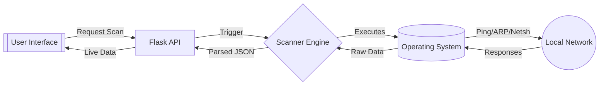

<div align="center">

<h1>GARUDA QUANTUM DEFENSE SYSTEM</h1>

<p>Advanced WiFi network scanner and security assessment platform with multi-method device detection and real-time threat analysis.</p>

<p>
  <a href="https://img.shields.io/badge/Python-3.10+-3776AB?logo=python&logoColor=white">  </a>
  <a href="https://img.shields.io/badge/Flask-3.0.0-000000?logo=flask&logoColor=white">  </a>
  <a href="https://img.shields.io/badge/HTML5-E34F26?logo=html5&logoColor=white">  </a>
  <a href="https://img.shields.io/badge/CSS3-1572B6?logo=css3&logoColor=white">  </a>
  <a href="https://img.shields.io/badge/Platform-Cross--Platform-lightgrey">  </a>
  <a href="https://img.shields.io/badge/License-MIT-8B5CF6">  </a>
</p>

<p>
  <a href="#-installation">Install</a> •
  <a href="#-features">Features</a> •
  <a href="#-how-it-works">How it works</a> •
  <a href="DEPLOYMENT_GUIDE.md">Deployment Guide</a>
</p>


<!-- Note: Replace the above image path with an actual screenshot if available, or remove if not -->

</div>

> “Gateway Analysis & Response Unit for Device Audit. A cyberpunk-styled network monitor that feels like a sci-fi command center.”

---

## 🧭 Overview

GARUDA is a powerful, local-first network security tool designed to audit WiFi networks and detect connected devices with aggressive precision. Unlike standard scanners, GARUDA employs a multi-method approach (Ping sweep + ARP cache forcing + NetBIOS) to uncover devices that might otherwise remain hidden.

It features:
- **Cyberpunk UI**: A fully immersive, sci-fi interface with real-time animations and particle effects.
- **Deep Scanning**: Aggressive device detection using OS-specific native tools (`netsh`, `nmcli`, `airport`).
- **Security Assessment**: Instant analysis of encryption protocols (WEP, WPA2, WPA3) and MITM risk evaluation.
- **Cross-Platform Backend**: Runs seamlessly on Windows, macOS, Linux, and Raspberry Pi.

---

## 🧰 Tech Stack

<div align="center">
  
</div>

| Layer | Tools |
| ----- | ----- |
| **Backend Core** | Python 3, Flask, Subprocess (Native OS Commands) |
| **Network Tools** | ARP, Ping, Netsh (Win), Nmcli (Linux), Airport (Mac) |
| **Frontend** | Vanilla HTML5/CSS3, Chart.js for visualization |
| **Styling** | Custom CSS variables, Keyframe animations, Glassmorphism |
| **Deployment** | Docker, Systemd (Pi), Batch/PowerShell scripts |

---

## 🗂️ Folder Structure

```bash
garuda
├── garudaa/                # Core application source
│   ├── garuda_backend.py   # Flask API server & scanning logic
│   ├── index.html          # Main dashboard interface
│   ├── script.js           # Frontend logic & API integration
│   └── styles.css          # Cyberpunk styling & animations
├── start_garuda.bat        # Windows one-click launcher
├── start_garuda.ps1        # PowerShell launcher with menu
├── update_api_url.ps1      # Helper to configure backend IP
├── DEPLOYMENT_GUIDE.md     # Detailed deployment instructions
├── QUICK_START.md          # Fast setup guide
└── requirements.txt        # Python dependencies
```

---

## ⚡ Installation

### Option 1: Quick Start (Windows)
1. **Clone** the repository:
   ```bash
   git clone https://github.com/DHRUVASAI/GARUDA-.git
   cd GARUDA-
   ```
2. **Double-click** `start_garuda.bat`.
3. Select **Option 1** (Local Deployment).
4. The dashboard will open automatically in your browser.

### Option 2: Manual Setup (Any OS)

1. **Install Dependencies**
   ```bash
   pip install -r requirements.txt
   # or manually: pip install flask flask-cors
   ```

2. **Start Backend**
   ```bash
   python garudaa/garuda_backend.py
   ```

3. **Start Frontend** (in a separate terminal)
   ```bash
   cd garudaa
   python -m http.server 8000
   ```

4. **Access**
   Open `http://localhost:8000/index.html` (or `garuda-visualization.html`)

---

## 🎬 Feature Previews

| Preview | Description |
| ------- | ----------- |
|  | **Cyberpunk Dashboard** — Real-time system status, threat level monitoring, and particle-based visual effects. |
|  | **Deep Scan Results** — Comprehensive network topology, device identification, and security assessment after a full scan. |

---

## 🧩 Feature Matrix

| Module | Capabilities |
| ------ | ------------ |
| **Scanner Core** | Multi-threaded ping sweep, ARP table extraction, MAC vendor lookup |
| **Threat Engine** | Encryption protocol analysis (Open/WEP/WPA2/WPA3), MITM risk scoring |
| **Visualizer** | Network topology graph, signal strength heatmaps, device categorization |
| **Dashboard** | Real-time traffic stats, node counting, "Matrix" style data grid |

---

## 🔄 How it works



---

## 📊 Scan Methods

GARUDA uses a tiered approach to ensure no device is missed:

1.  **Phase 1: Ping Sweep** - Rapidly pings all 254 usable addresses in the subnet.
2.  **Phase 2: ARP Forcing** - Forces the OS to populate its ARP table by attempting connections.
3.  **Phase 3: Table Extraction** - Reads the system ARP cache to find devices that ignore ICMP (Ping) but exist on the network.
4.  **Phase 4: Vendor Analysis** - Matches MAC addresses against a database to identify device manufacturers (Apple, Espressif, Raspberry Pi, etc.).

---

## 🤝 Contributing

- **Fork** the repository.
- **Create** a feature branch (`git checkout -b feat/new-scanner-module`).
- **Commit** your changes.
- **Push** to the branch and open a **Pull Request**.

---

_Built with 💻 and ☕ by the GARUDA Team._
