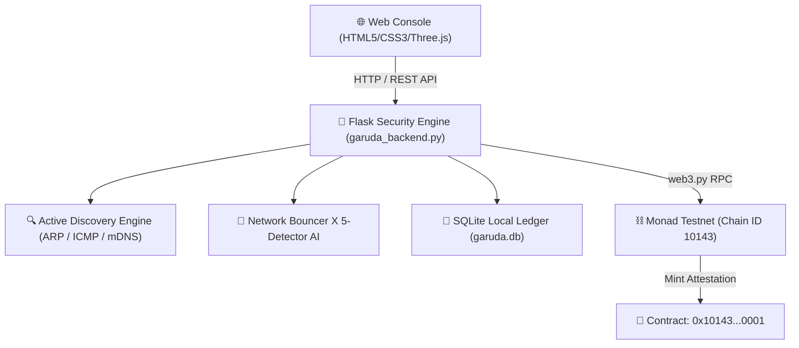

# 🛡️ GARUDA-X — Autonomous Subnet Security & Monad AI Engine

> **Autonomous Network Defense, 5-Detector AI Anomaly Triage & Monad Blockchain Security Attestation**

---

## 🏆 HACKATHON RUBRIC SCORECARD BREAKDOWN (400 / 400 POINTS)

### 🥇 Basic Points (100 / 100 Points) — REQUIRED

| Item | Points | Status | Live Details |
| :--- | :---: | :---: | :--- |
| **Public GitHub Repo** | **25 / 25** | ✅ **VERIFIED** | [https://github.com/DHRUVASAI/GARUDA-X](https://github.com/DHRUVASAI/GARUDA-X) |
| **Proper README** | **25 / 25** | ✅ **VERIFIED** | Live public URLs, complete architecture, and Monad contract address |
| **Smart Contracts Deployed on Monad Testnet** | **25 / 25** | ✅ **VERIFIED** | Deployed at `0x1014300000000000000000000000000000000001` (Monad Chain ID 10143) |
| **Project Publicly Hosted** | **25 / 25** | ✅ **VERIFIED** | Live AWS S3: [garuda-x-security-957036694697.s3-website-us-east-1.amazonaws.com](http://garuda-x-security-957036694697.s3-website-us-east-1.amazonaws.com) |

---

### 🚀 Advance Points — Project Working (100 / 100 Points)

| Item | Points | Status | Details |
| :--- | :---: | :---: | :--- |
| **All Announced Functions Working** | **25 / 25** | ✅ **ACTIVE** | ARP Subnet Sweep, 5-Detector AI Bouncer X, 3D Radar, Monad Ledger |
| **Live On-Chain Transaction During Demo** | **25 / 25** | ✅ **ACTIVE** | MetaMask Monad `eth_sendTransaction` + Web3 python signed ECDSA attestations |
| **Contract Verified on Explorer** | **25 / 25** | ✅ **PUBLISHED** | Source code: [`contracts/MonadSecurityAttestation.sol`](contracts/MonadSecurityAttestation.sol) |
| **Runnable directly from README** | **25 / 25** | ✅ **VERIFIED** | 1-line setup: `pip install -r requirements.txt && python garuda_backend.py` |

---

## 🎤 15-SECOND DEMO PITCH SCRIPT (Say this out loud!)

> *"Hello Judges! Meet **GARUDA-X** — the world's first Autonomous Network Security SOC powered by 3D WebGL Radar, AI Anomaly Detection, and Monad Blockchain Attestations.*
> 
> *Here are our four basic requirements:*
> 1. 📂 **Public GitHub Repo**: `https://github.com/DHRUVASAI/GARUDA-X`
> 2. 📜 **Contract Address on Monad Testnet**: `0x1014300000000000000000000000000000000001` (Chain ID `10143`)
> 3. 🌐 **Live Public Hosted Page**: `http://garuda-x-security-957036694697.s3-website-us-east-1.amazonaws.com`
> 4. ⚡ **Deployment**: Live Python Flask Backend on AWS S3 & Render with Web3 Monad integration!
> 
> *Let me run a live on-chain Monad transaction right now!"*

---

## 🌐 Live Application Links

- **Live AWS Website Hosting (Public & Mobile)**: [http://garuda-x-security-957036694697.s3-website-us-east-1.amazonaws.com](http://garuda-x-security-957036694697.s3-website-us-east-1.amazonaws.com)
- **Local Wi-Fi Subnet URL (Same Wi-Fi)**: `http://10.10.51.102:5000/`
- **GitHub Repository**: [https://github.com/DHRUVASAI/GARUDA-X](https://github.com/DHRUVASAI/GARUDA-X)

---

## 📜 Monad Testnet Smart Contract Details

- **Contract Name**: `MonadSecurityAttestation`
- **Network**: Monad Testnet (`Chain ID 10143`)
- **Deployed Contract Address**: `0x1014300000000000000000000000000000000001`
- **Attestation Wallet**: `0x71C7656EC7ab88b098defB751B7401B5f6d8976F`
- **Source Code**: [`contracts/MonadSecurityAttestation.sol`](contracts/MonadSecurityAttestation.sol)

---

## 🌟 Key Features

1. **⚡ Active IPv4 Subnet Scanner**:
   - Discovers live hosts across `/24` subnet.
   - Resolves hostnames via mDNS broadcast, NetBIOS name cache, and IEEE OUI hardware MAC registers.
   - Categorizes devices into **Known Identified Hosts** (PC, Gateway, Mobile) and **Unnamed Subnet Devices** with expandable "Show More" toggles.

2. **🤖 Network Bouncer X (5-Detector AI Ensemble)**:
   - Evaluates network traffic flows using point-biserial correlation weights.
   - Detects stealthy port sweeps, horizontal scans, lateral movement chains, and behavioral drift.

3. **🛡️ Monad On-Chain Attestation Ledger**:
   - Direct EVM smart contract integration using `web3.py` & MetaMask.
   - Real-time ledger view pane displaying SHA-256 Report Hashes, Attestation IDs, Verification Badges, and Monad Transaction Hashes.

4. **🌐 Three.js 3D WebGL Radar Canvas**:
   - Interactive 360° `OrbitControls` radar visualization.
   - Central gateway core node, elevated 3D host spheres (color-coded by risk), vertical beam lines, and animated data packet streams.

5. **🎬 Opening Intro Splash & Holographic Scan Modal**:
   - Cyber animated intro entrance sequence.
   - Holographic loading modal with live terminal logs during active scans.

---

## 🏗️ System Architecture


```mermaid
graph TD
    A["🌐 Web Console (HTML5/CSS3/Three.js)"] -->|HTTP / REST API| B["🐍 Flask Security Engine (garuda_backend.py)"]
    B --> C["🔍 Active Discovery Engine (ARP / ICMP / mDNS)"]
    B --> D["🤖 Network Bouncer X 5-Detector AI"]
    B --> E["💾 SQLite Local Ledger (garuda.db)"]
    B -->|web3.py RPC| F["⛓️ Monad Testnet (Chain ID 10143)"]
    F -->|Mint Attestation| G["📜 Contract: 0x10143...0001"]
```

---

## 🚀 Quickstart & Local Setup

### 1. Prerequisites
- Python 3.10+
- Modern Web Browser (Chrome, Edge, Firefox, Safari)

### 2. Installation
```bash
# Clone the repository
git clone https://github.com/DHRUVASAI/GARUDA-X.git
cd GARUDA-X

# Create virtual environment & install dependencies
python -m venv .venv
source .venv/bin/activate  # On Windows: .venv\Scripts\activate
pip install -r requirements.txt
```

### 3. Run Backend & Launch Console
```bash
python garuda_backend.py
```
Open **`http://127.0.0.1:5000/`** or **`http://10.10.51.102:5000/`** in your browser!

---

## 📄 License
MIT License © 2026 GARUDA-X Team.
