<div align="center">

# 🛡️ GARUDA QUANTUM DEFENSE SYSTEM

### Gateway Analysis & Response Unit for Device Audit

**Advanced WiFi Network Scanner & Security Assessment Platform**

[](https://www.python.org/)
[](https://flask.palletsprojects.com/)
[](https://developer.mozilla.org/en-US/docs/Web/HTML)
[](https://developer.mozilla.org/en-US/docs/Web/CSS)
[](https://developer.mozilla.org/en-US/docs/Web/JavaScript)
[](LICENSE)
[](https://github.com/DHRUVASAI/GARUDA-)
[](https://github.com/DHRUVASAI/GARUDA-)

[](https://github.com/DHRUVASAI/GARUDA-)
[](https://www.microsoft.com/windows)
[](https://www.apple.com/macos/)
[](https://www.linux.org/)
[](https://www.raspberrypi.org/)

---

<p align="center">
  <a href="#-overview">Overview</a> •
  <a href="#-screenshots">Screenshots</a> •
  <a href="#-features">Features</a> •
  <a href="#-tech-stack">Tech Stack</a> •
  <a href="#-installation">Installation</a> •
  <a href="#-quick-start">Quick Start</a> •
  <a href="#-api-documentation">API Docs</a> •
  <a href="#-deployment">Deployment</a> •
  <a href="#-contributing">Contributing</a>
</p>

---


*"A cyberpunk-styled network monitor that feels like a sci-fi command center."*

</div>

---

## 📋 Table of Contents

- [🎯 Overview](#-overview)
- [📸 Screenshots](#-screenshots)
- [✨ Features](#-features)
- [🛠️ Tech Stack](#️-tech-stack)
- [📁 Folder Structure](#-folder-structure)
- [⚡ Installation](#-installation)
- [🚀 Quick Start](#-quick-start)
- [🏗️ Architecture](#️-architecture)
- [📡 API Endpoints](#-api-endpoints)
- [🔒 Security Notes](#-security-notes)
- [🌐 Deployment](#-deployment)
- [🧪 Testing](#-testing)
- [🤝 Contributing](#-contributing)
- [📜 License](#-license)
- [🙏 Acknowledgments](#-acknowledgments)
- [📞 Support & Contact](#-support--contact)

---

## 🎯 Overview

**GARUDA** (Gateway Analysis & Response Unit for Device Audit) is a powerful, local-first network security tool designed to audit WiFi networks and detect connected devices with aggressive precision. Unlike standard scanners, GARUDA employs a **multi-method approach** (Ping sweep + ARP cache forcing + NetBIOS) to uncover devices that might otherwise remain hidden.

> **"A Neighborhood Watch for Urban Cyber Safety"** - GARUDA helps you monitor and secure your local network, just like a neighborhood watch program protects your community.

### What Makes GARUDA Special?

- 🎨 **Cyberpunk UI**: Fully immersive, sci-fi interface with real-time animations and particle effects
- 🔍 **Deep Scanning**: Aggressive device detection using OS-specific native tools (`netsh`, `nmcli`, `airport`)
- 🛡️ **Security Assessment**: Instant analysis of encryption protocols (WEP, WPA2, WPA3) and MITM risk evaluation
- 🌍 **Cross-Platform**: Runs seamlessly on Windows, macOS, Linux, and Raspberry Pi
- ⚡ **Multi-Method Detection**: Combines ping sweeps, ARP table analysis, and forced cache refresh for maximum accuracy
- 📊 **Real-Time Visualization**: Network topology graphs, device categorization, and threat level monitoring

### Key Highlights

| Feature | Description |
|---------|-------------|
| **Multi-Phase Scanning** | 4-phase detection process ensures no device is missed |
| **Threat Analysis** | Real-time security assessment with exploit risk percentages |
| **Network Topology** | Visual representation of network structure and connections |
| **Vendor Detection** | MAC address-based device manufacturer identification |
| **Traffic Monitoring** | Real-time network traffic statistics and analysis |

---

## 📸 Screenshots

<div align="center">

### 🎮 Main Dashboard


*Cyberpunk-themed dashboard with real-time system status, threat level monitoring, and particle-based visual effects*

---

### 🔍 Full Network Scan Results


*Comprehensive network topology, device identification, and security assessment after a full scan*

---

### 📊 Network Topology Visualization

*Interactive network graph showing gateway, connected devices, and network relationships*

---

### 🛡️ Security Threat Analysis

*Real-time threat assessment with MITM risk evaluation and security recommendations*

---

</div>

---

## ✨ Features

### Core Capabilities

| Module | Capabilities |
|--------|-------------|
| **🔍 Scanner Core** | Multi-threaded ping sweep, ARP table extraction, MAC vendor lookup |
| **🛡️ Threat Engine** | Encryption protocol analysis (Open/WEP/WPA2/WPA3), MITM risk scoring |
| **📊 Visualizer** | Network topology graph, signal strength heatmaps, device categorization |
| **📱 Dashboard** | Real-time traffic stats, node counting, "Matrix" style data grid |

### Detailed Feature List

#### 🔐 Security Assessment
- **Encryption Analysis**: Detects WEP, WPA, WPA2, WPA3 protocols
- **MITM Risk Scoring**: Calculates exploitation probability (3.7% - 99.9%)
- **Threat Level Classification**: CRITICAL, HIGH, MEDIUM, LOW, SECURE
- **Security Recommendations**: Actionable advice based on network security

#### 🌐 Network Scanning
- **Multi-Method Detection**: Ping + ARP + NetBIOS combination
- **OS-Specific Tools**: Native commands for Windows (`netsh`), macOS (`airport`), Linux (`nmcli`)
- **Parallel Processing**: Multi-threaded scanning for faster results
- **Device Discovery**: Finds hidden devices that ignore ICMP requests

#### 📊 Visualization & Analytics
- **Network Topology**: Interactive SVG-based network graph
- **Device Categorization**: Gateway, local device, network nodes
- **Traffic Statistics**: Bytes/packets sent and received
- **Real-Time Updates**: Live status monitoring and updates

#### 🎨 User Interface
- **Cyberpunk Theme**: Sci-fi inspired design with neon accents
- **Particle Effects**: Animated background particles
- **Responsive Design**: Works on desktop, tablet, and mobile
- **Smooth Animations**: CSS keyframe animations and transitions

---

## 🛠️ Tech Stack

### Backend Technologies

| Technology | Version | Purpose |
|------------|---------|---------|
| **Python** | 3.10+ | Core programming language |
| **Flask** | 3.0.0 | Web framework and API server |
| **Flask-CORS** | 4.0.0 | Cross-origin resource sharing |
| **Subprocess** | Built-in | Execute OS-native network commands |
| **ThreadPoolExecutor** | Built-in | Parallel network scanning |

### Frontend Technologies

| Technology | Version | Purpose |
|------------|---------|---------|
| **HTML5** | Latest | Structure and semantic markup |
| **CSS3** | Latest | Styling, animations, glassmorphism effects |
| **JavaScript (ES6+)** | Latest | Frontend logic and API integration |
| **Chart.js** | 3.9.1 | Data visualization and charts |

### System Tools

| Tool | Platform | Purpose |
|------|----------|---------|
| **netsh** | Windows | WiFi network scanning |
| **airport** | macOS | WiFi network scanning |
| **nmcli** | Linux | NetworkManager CLI for WiFi |
| **arp** | All | ARP table access |
| **ping** | All | Network connectivity testing |

### DevOps & Deployment

| Tool | Purpose |
|------|---------|
| **Docker** | Containerization (optional) |
| **GitHub Pages** | Frontend hosting |
| **Railway** | Backend deployment (optional) |
| **Systemd** | Service management (Raspberry Pi) |

---

## 📁 Folder Structure

```
GARUDA-/
├── 📂 garudaa/                    # Core application source (if files are organized)
│   ├── 🐍 garuda_backend.py       # Flask API server & scanning logic
│   ├── 🌐 index.html              # Main dashboard interface
│   ├── 🎨 garuda-visualization.html # Enhanced visualization dashboard
│   ├── 📜 script.js               # Frontend logic & API integration
│   ├── 🎨 styles.css              # Cyberpunk styling & animations
│   ├── 🔧 diagnostic.html        # Diagnostic tools
│   └── 📖 README.md               # Component documentation
│
├── 📂 public/                     # Public assets (if exists)
│   └── 📂 assets/
│       ├── 🖼️ garuda_hero.png     # Hero screenshot
│       └── 🖼️ garuda_full_scan.png # Full scan screenshot
│
├── 🐍 garuda_backend.py           # Flask API server (if in root)
├── 🌐 index.html                  # Main dashboard (if in root)
├── 🎨 garuda-visualization.html   # Visualization dashboard (if in root)
├── 📜 script.js                   # Frontend logic (if in root)
├── 🎨 styles.css                  # Styling (if in root)
├── 🔧 diagnostic.html             # Diagnostic tools (if in root)
│
├── 🚀 start_garuda.bat            # Windows one-click launcher
├── ⚡ start_garuda.ps1            # PowerShell launcher with menu
├── 🔧 update_api_url.ps1          # Helper to configure backend IP
├── 🐍 app.py                      # Railway/cloud deployment entry point
├── 📋 requirements.txt            # Python dependencies
├── 📄 Procfile                    # Process file for cloud deployment
├── ⚙️ railway.json                # Railway configuration
│
├── 📚 Documentation/
│   ├── 📖 README.md               # This file
│   ├── 🚀 QUICK_START.md          # Fast setup guide
│   ├── 📘 DEPLOYMENT_GUIDE.md     # Detailed deployment instructions
│   ├── ✅ DEPLOYMENT_CHECKLIST.md  # Deployment checklist
│   └── 📊 DEPLOYMENT_STATUS.md    # Deployment status tracking
│
└── 📄 LICENSE                     # MIT License
```

> **Note:** File structure may vary. Check the [repository](https://github.com/DHRUVASAI/GARUDA-) to see the actual file organization.

### Key Files Explained

| File | Description |
|------|-------------|
| `garuda_backend.py` or `garudaa/garuda_backend.py` | Main Flask application with all API endpoints and scanning logic |
| `garuda-visualization.html` or `garudaa/garuda-visualization.html` | Enhanced dashboard with topology visualization |
| `index.html` or `garudaa/index.html` | Main dashboard interface |
| `start_garuda.ps1` | Interactive PowerShell script for easy deployment |
| `requirements.txt` | Python package dependencies |
| `DEPLOYMENT_GUIDE.md` | Comprehensive deployment instructions |

> **Note:** File paths depend on repository structure. Check [GitHub](https://github.com/DHRUVASAI/GARUDA-) for actual file locations.

---

## ⚡ Installation

### Prerequisites

- **Python 3.10+** installed on your system
- **Network access** to the WiFi network you want to scan
- **Administrator/root privileges** (recommended for full functionality)
- **Modern web browser** (Chrome, Firefox, Edge, Safari)

### Step 1: Clone the Repository

```bash
git clone https://github.com/DHRUVASAI/GARUDA-.git
cd GARUDA-
```

> **Repository:** [https://github.com/DHRUVASAI/GARUDA-](https://github.com/DHRUVASAI/GARUDA-)

### Step 2: Install Python Dependencies

```bash
# Using pip
pip install -r requirements.txt

# Or install manually
pip install flask==3.0.0 flask-cors==4.0.0
```

### Step 3: Verify Installation

```bash
# Check Python version
python --version  # Should be 3.10 or higher

# Verify Flask installation
python -c "import flask; print(flask.__version__)"
```

### Step 4: System-Specific Setup

#### Windows
- ✅ No additional setup required
- `netsh` command is built-in

#### macOS
- ✅ No additional setup required
- `airport` utility is built-in

#### Linux
```bash
# Install NetworkManager (if not already installed)
sudo apt install network-manager    # Ubuntu/Debian
sudo dnf install NetworkManager     # Fedora
sudo pacman -S networkmanager       # Arch Linux
```

#### Raspberry Pi
```bash
# Same as Linux setup
sudo apt install network-manager
```

---

## 🚀 Quick Start

### Option 1: Automated Setup (Windows) ⚡

**Fastest method - 1 minute setup:**

1. **Double-click** `start_garuda.bat`
2. Select **Option 1** (Local Deployment)
3. Browser opens automatically → Start scanning!

### Option 2: Manual Setup (All Platforms)

#### Terminal 1: Start Backend Server

```bash
# Navigate to project directory
cd GARUDA-

# Start Flask backend
python garuda_backend.py
# OR if files are in garudaa/ subdirectory:
# python garudaa/garuda_backend.py
```

You should see:
```
============================================================
◈ GARUDA QUANTUM DEFENSE SYSTEM BACKEND ◈
============================================================
System: Windows
Scan Mode: MULTI-METHOD (Ping + ARP + Force Refresh)
Starting API server on http://localhost:5000

Available Endpoints:
  GET  /api/health          - System health check
  GET  /api/scan/nearby     - Scan nearby WiFi networks
  GET  /api/scan/connected  - Check connected network
  GET/POST /api/scan/full   - Full network scan (AGGRESSIVE)
============================================================
```

#### Terminal 2: Start Frontend Server

```bash
# If files are in root directory:
python -m http.server 8000

# OR if files are in garudaa/ subdirectory:
cd garudaa
python -m http.server 8000
```

#### Open in Browser

Navigate to:
```
# If files are in root:
http://localhost:8000/index.html
# OR
http://localhost:8000/garuda-visualization.html

# If files are in garudaa/ subdirectory:
http://localhost:8000/garudaa/index.html
# OR
http://localhost:8000/garudaa/garuda-visualization.html
```

### Option 3: PowerShell Menu (Windows)

```powershell
.\start_garuda.ps1
```

Select from menu:
- **Option 1**: Local Deployment (backend + frontend)
- **Option 2**: Network Deployment (accessible from other devices)
- **Option 3**: Backend Only (for hybrid deployment)

---

## 🏗️ Architecture

### System Architecture

```mermaid
flowchart TB
    User[👤 User Browser]
    Frontend[🌐 Frontend HTML/CSS/JS]
    API[🔌 Flask API Server]
    Scanner[🔍 Scanner Engine]
    OS[💻 Operating System]
    Network[🌐 Local Network]
    
    User -->|HTTP Request| Frontend
    Frontend -->|AJAX/Fetch| API
    API -->|Trigger| Scanner
    Scanner -->|Execute Commands| OS
    OS -->|Ping/ARP/Netsh| Network
    Network -->|Responses| OS
    OS -->|Raw Data| Scanner
    Scanner -->|Parsed JSON| API
    API -->|JSON Response| Frontend
    Frontend -->|Render UI| User
```



### Scanning Methodology

GARUDA uses a **4-phase multi-method approach** to ensure comprehensive device detection:

#### Phase 1: Ping Sweep
- Rapidly pings all 254 usable addresses in the subnet
- Uses parallel threading (100 workers) for speed
- Timeout: 300ms per IP
- **Result**: Active IPs that respond to ICMP

#### Phase 2: ARP Cache Forcing
- Forces OS to populate ARP table by attempting connections
- Broadcasts to all IPs in network range
- Uses ThreadPoolExecutor (50 workers)
- **Result**: Devices that ignore ping but exist on network

#### Phase 3: ARP Table Extraction
- Reads system ARP cache
- Parses MAC addresses and IP mappings
- Filters out broadcast and multicast addresses
- **Result**: Complete device list from ARP table

#### Phase 4: Vendor Analysis
- Matches MAC addresses against OUI database
- Identifies device manufacturers (Apple, Google, TP-Link, etc.)
- Categorizes device types
- **Result**: Enhanced device information with vendor names

### Data Flow

```
User Action
    ↓
Frontend: initiateScan()
    ↓
API: POST /api/scan/full
    ↓
Scanner: scan_with_multimethod()
    ↓
Phase 1: Ping Sweep (parallel)
    ↓
Phase 2: ARP Refresh (parallel)
    ↓
Phase 3: ARP Table Read
    ↓
Phase 4: Vendor Lookup
    ↓
Security Assessment
    ↓
JSON Response
    ↓
Frontend: updateUI()
    ↓
Visualization: drawNetworkTopology()
```

### Key Optimizations

- **Parallel Processing**: Multi-threaded scanning reduces total scan time
- **Caching**: ARP table reuse for faster subsequent scans
- **Smart Filtering**: Excludes broadcast/multicast addresses automatically
- **Error Handling**: Graceful degradation if OS commands fail
- **Resource Management**: Thread pool limits prevent system overload

---

## 📡 API Endpoints

### Base URL
```
http://localhost:5000
```

### Endpoints

#### 🔍 Health Check

```http
GET /api/health
```

**Response:**
```json
{
  "status": "OPERATIONAL",
  "timestamp": "2024-11-19T10:30:00.123456",
  "system": "Windows",
  "scan_method": "MULTI_METHOD"
}
```

---

#### 📡 Scan Nearby Networks

```http
GET /api/scan/nearby
```

**Response:**
```json
{
  "status": "success",
  "timestamp": "2024-11-19T10:30:00.123456",
  "networks_found": 5,
  "networks": [
    {
      "ssid": "MyNetwork",
      "bssid": "AA:BB:CC:DD:EE:FF",
      "signal": "85%",
      "encryption": "WPA2-Personal",
      "security_assessment": {
        "threat_level": "MEDIUM",
        "mitm_risk": "MODERATE",
        "exploit_risk": "45.2%"
      }
    }
  ]
}
```

---

#### 🔗 Get Connected Network

```http
GET /api/scan/connected
```

**Response:**
```json
{
  "status": "success",
  "timestamp": "2024-11-19T10:30:00.123456",
  "connected_network": {
    "ssid": "MyNetwork",
    "bssid": "AA:BB:CC:DD:EE:FF",
    "signal": "85%",
    "encryption": "WPA2-Personal",
    "security_assessment": {
      "threat_level": "MEDIUM",
      "color": "#ff0",
      "mitm_risk": "MODERATE",
      "vulnerability": "WPA2-PSK - Vulnerable to dictionary attacks",
      "description": "WPA2-Personal is vulnerable to KRACK attacks...",
      "recommendation": "Use strong passwords (20+ characters)...",
      "exploit_risk": "45.2%"
    }
  },
  "local_ip": "192.168.1.100",
  "gateway": "192.168.1.1"
}
```

---

#### 🚀 Full Network Scan

```http
GET /api/scan/full
POST /api/scan/full
```

**Response:**
```json
{
  "status": "success",
  "timestamp": "2024-11-19T10:30:00.123456",
  "scan_duration": "12.5s",
  "scan_method": "MULTI_METHOD (PING+ARP)",
  "connected_network": {
    "ssid": "MyNetwork",
    "encryption": "WPA2-Personal",
    "security_assessment": {...}
  },
  "local_ip": "192.168.1.100",
  "gateway": "192.168.1.1",
  "nodes_detected": 8,
  "addresses_scanned": 254,
  "devices": [
    {
      "ip": "192.168.1.1",
      "mac": "AA:BB:CC:DD:EE:FF",
      "type": "GATEWAY",
      "vendor": "TP-Link",
      "status": "ACTIVE",
      "detection_method": "PING+ARP",
      "threat_level": "SECURE"
    }
  ],
  "network_traffic": {
    "bytes_sent": "1.2 GB",
    "bytes_received": "3.4 GB",
    "packets_sent": "1,234,567",
    "packets_received": "2,345,678"
  },
  "security_summary": {
    "threat_level": "MEDIUM",
    "mitm_risk": "MODERATE",
    "total_devices": 8,
    "secure_devices": 2,
    "monitoring_devices": 6
  }
}
```

---

## 🔒 Security Notes

### ⚠️ Important Security Considerations

1. **Authorization Required**
   - ⚠️ Only scan networks you own or have explicit permission to test
   - ⚠️ Unauthorized network scanning may be illegal in your jurisdiction
   - ⚠️ This tool is for educational and authorized security testing only

2. **Network Exposure**
   - ⚠️ Backend opens port 5000 - don't expose to the internet without authentication
   - ⚠️ Use firewall rules to restrict access to local network only
   - ⚠️ Consider using VPN for remote access instead of port forwarding

3. **Data Privacy**
   - ⚠️ Scan results contain sensitive network information
   - ⚠️ Keep logs private and secure
   - ⚠️ Don't commit scan results to version control

4. **Production Deployment**
   - ✅ Add authentication (HTTP Basic Auth, OAuth, etc.)
   - ✅ Use HTTPS (SSL/TLS certificates)
   - ✅ Implement rate limiting
   - ✅ Restrict CORS to specific origins
   - ✅ Add input validation and sanitization

### Security Best Practices

```bash
# Example: Add firewall rule (Windows)
New-NetFirewallRule -DisplayName "GARUDA" -Direction Inbound -Protocol TCP -LocalPort 5000 -Action Allow -RemoteAddress 192.168.1.0/24

# Example: Add authentication (Python)
from flask_httpauth import HTTPBasicAuth
auth = HTTPBasicAuth()

@auth.verify_password
def verify_password(username, password):
    return username == "admin" and password == "secure_password"
```

---

## 🌐 Deployment

### Deployment Options

GARUDA supports multiple deployment strategies:

| Method | Backend Location | Frontend Location | Best For |
|--------|-----------------|-------------------|----------|
| **Local** | Localhost | Localhost | Development, testing |
| **Hybrid** | Local network | GitHub Pages | Production, demos |
| **Network** | Local network | Local network | Home/office monitoring |
| **Cloud** | Railway/Heroku | GitHub Pages | Public demos (limited) |

### Method 1: Hybrid Deployment (Recommended) ⭐

**Backend:** Local network (your computer/Raspberry Pi)  
**Frontend:** GitHub Pages (public access)

#### Step 1: Configure Backend URL

```powershell
.\update_api_url.ps1
# Select option 2 (Local network)
# Note the IP address shown (e.g., 192.168.1.100)
```

#### Step 2: Update Frontend API URL

Edit `garudaa/garuda-visualization.html`:
```javascript
const API_BASE = 'http://192.168.1.100:5000';  // Your local IP
```

#### Step 3: Start Backend

```powershell
.\start_garuda.ps1
# Select option 3 (Backend only)
# Keep this running
```

#### Step 4: Deploy Frontend to GitHub Pages

```bash
git add .
git commit -m "Configure for local backend"
git push origin main
# OR if using master branch:
# git push origin master
```

#### Step 5: Enable GitHub Pages

1. Go to: [Repository Settings → Pages](https://github.com/DHRUVASAI/GARUDA-/settings/pages)
2. Source: **main** (or **master**) → Folder: **/ (root)**
3. Click **Save**
4. Wait 2-3 minutes for deployment

#### Step 6: Access Your App

- URL: `https://dhruvasai.github.io/GARUDA-/index.html` or `https://dhruvasai.github.io/GARUDA-/garuda-visualization.html`
- **Important:** Your device must be on the same WiFi network as the backend

---

### Method 2: Fully Local Deployment

**Everything runs on your computer:**

```bash
# Terminal 1: Backend
python garudaa/garuda_backend.py

# Terminal 2: Frontend
cd garudaa
python -m http.server 8000

# Open browser
http://localhost:8000/garuda-visualization.html
```

---

### Method 3: Network Deployment

**Accessible from other devices on your network:**

```powershell
# Start backend on network
.\start_garuda.ps1
# Select option 2 (Network Deployment)

# On other devices, open:
http://YOUR_IP:8000/garuda-visualization.html
```

---

### Method 4: Raspberry Pi Server

**24/7 network monitoring:**

```bash
# On Raspberry Pi
git clone https://github.com/DHRUVASAI/GARUDA-.git
cd GARUDA-
pip3 install -r requirements.txt

# Start backend (adjust path based on your file structure)
python3 garuda_backend.py
# OR if files are in garudaa/ subdirectory:
# python3 garudaa/garuda_backend.py

# Create systemd service
sudo nano /etc/systemd/system/garuda.service
```

Service file:
```ini
[Unit]
Description=GARUDA Network Scanner
After=network.target

[Service]
Type=simple
User=pi
WorkingDirectory=/home/pi/GARUDA-
ExecStart=/usr/bin/python3 garudaa/garuda_backend.py
Restart=always

[Install]
WantedBy=multi-user.target
```

Enable and start:
```bash
sudo systemctl enable garuda
sudo systemctl start garuda
```

---

## 🧪 Testing

### Manual Testing

#### Test Backend Health

```bash
curl http://localhost:5000/api/health
```

Expected response:
```json
{"status": "OPERATIONAL", "system": "Windows", ...}
```

#### Test Network Scan

```bash
curl http://localhost:5000/api/scan/connected
```

#### Test Full Scan

```bash
curl -X POST http://localhost:5000/api/scan/full
```

### Browser Testing

1. Open browser console (F12)
2. Navigate to dashboard
3. Click "INITIALIZE DEEP SCAN"
4. Check console for errors
5. Verify network requests in Network tab

### Troubleshooting

| Issue | Solution |
|-------|----------|
| **Backend won't start** | Check if port 5000 is in use: `netstat -ano \| findstr :5000` |
| **CORS errors** | Ensure Flask-CORS is installed and enabled |
| **No devices detected** | Run as Administrator, check firewall settings |
| **Connection refused** | Verify backend is running and accessible |
| **Scan timeout** | Increase timeout in `garuda_backend.py` |

---

## 🤝 Contributing

We welcome contributions! Here's how you can help:

### How to Contribute

1. **Fork the Repository**
   - Click the "Fork" button on [GitHub](https://github.com/DHRUVASAI/GARUDA-)
   - Or clone your fork:
   ```bash
   git clone https://github.com/YOUR_USERNAME/GARUDA-.git
   cd GARUDA-
   ```

2. **Create a Feature Branch**
   ```bash
   git checkout -b feat/your-feature-name
   ```

3. **Make Your Changes**
   - Follow existing code style
   - Add comments for complex logic
   - Update documentation if needed

4. **Test Your Changes**
   - Test on multiple platforms if possible
   - Verify no breaking changes

5. **Commit Your Changes**
   ```bash
   git add .
   git commit -m "feat: Add your feature description"
   ```

6. **Push to Your Fork**
   ```bash
   git push origin feat/your-feature-name
   ```

7. **Open a Pull Request**
   - Describe your changes clearly
   - Reference any related issues
   - Include screenshots if UI changes

### Areas That Need Work

- 🔧 Better cross-platform compatibility
- 📊 More detailed traffic analysis
- 🔍 Real device fingerprinting
- 🛡️ Enhanced threat detection algorithms
- 📱 Mobile app version
- 🌐 WebSocket support for real-time updates
- 📈 Historical scan data tracking
- 🔔 Email/SMS alerts for threats

### Code Style

- **Python**: Follow PEP 8 guidelines
- **JavaScript**: Use ES6+ features, modern syntax
- **CSS**: Use BEM naming convention where applicable
- **Comments**: Document complex functions and algorithms

---

## 📜 License

This project is licensed under the **MIT License**.

```
MIT License

Copyright (c) 2024 GARUDA Team

Permission is hereby granted, free of charge, to any person obtaining a copy
of this software and associated documentation files (the "Software"), to deal
in the Software without restriction, including without limitation the rights
to use, copy, modify, merge, publish, distribute, sublicense, and/or sell
copies of the Software, and to permit persons to whom the Software is
furnished to do so, subject to the following conditions:

The above copyright notice and this permission notice shall be included in all
copies or substantial portions of the Software.

THE SOFTWARE IS PROVIDED "AS IS", WITHOUT WARRANTY OF ANY KIND, EXPRESS OR
IMPLIED, INCLUDING BUT NOT LIMITED TO THE WARRANTIES OF MERCHANTABILITY,
FITNESS FOR A PARTICULAR PURPOSE AND NONINFRINGEMENT. IN NO EVENT SHALL THE
AUTHORS OR COPYRIGHT HOLDERS BE LIABLE FOR ANY CLAIM, DAMAGES OR OTHER
LIABILITY, WHETHER IN AN ACTION OF CONTRACT, TORT OR OTHERWISE, ARISING FROM,
OUT OF OR IN CONNECTION WITH THE SOFTWARE OR THE USE OR OTHER DEALINGS IN THE
SOFTWARE.
```

### ⚠️ Legal Disclaimer

This software is provided for **educational and authorized security testing purposes only**. Users are responsible for ensuring they have proper authorization before scanning any network. Unauthorized network scanning may be illegal in your jurisdiction.

---

## 🙏 Acknowledgments

- **Flask Community** - For the excellent web framework
- **Chart.js** - For beautiful data visualizations
- **Network Security Researchers** - For inspiration and best practices
- **Open Source Community** - For tools and libraries that made this possible

### Special Thanks

- Contributors who have helped improve GARUDA
- Beta testers who provided valuable feedback
- Security researchers who shared insights

---

## 📞 Support & Contact

### Getting Help

1. **Check Documentation**
   - Read [QUICK_START.md](QUICK_START.md) for setup help
   - Review [DEPLOYMENT_GUIDE.md](DEPLOYMENT_GUIDE.md) for deployment issues
   - Check [garudaa/README.md](garudaa/README.md) for component details

2. **Check Issues**
   - Search existing [GitHub Issues](https://github.com/DHRUVASAI/GARUDA-/issues)
   - Check if your problem has been reported

3. **Create an Issue**
   - Use the issue template
   - Include system information (OS, Python version)
   - Provide error messages and logs
   - Describe steps to reproduce

### Contact Information

- **GitHub Profile**: [@DHRUVASAI](https://github.com/DHRUVASAI)
- **Repository**: [GARUDA-](https://github.com/DHRUVASAI/GARUDA-)
- **Issues**: [Report a Bug](https://github.com/DHRUVASAI/GARUDA-/issues/new)
- **Pull Requests**: [Contribute](https://github.com/DHRUVASAI/GARUDA-/pulls)

### Community

- ⭐ **Star the repo** if you find it useful
- 🍴 **Fork the repo** to contribute
- 📢 **Share** with others who might benefit
- 🐛 **Report bugs** to help improve GARUDA

---

<div align="center">

### ⚡ Made with 💻 and ☕ by the GARUDA Team

**Remember: With great power comes great responsibility. Only scan networks you own!**

---

[](https://github.com/DHRUVASAI/GARUDA-/stargazers)
[](https://github.com/DHRUVASAI/GARUDA-/network/members)
[](https://github.com/DHRUVASAI/GARUDA-/watchers)

**⭐ Star this repo if you find it useful!**

**Repository:** [https://github.com/DHRUVASAI/GARUDA-](https://github.com/DHRUVASAI/GARUDA-)  
**Last Updated:** November 19, 2024

</div>
